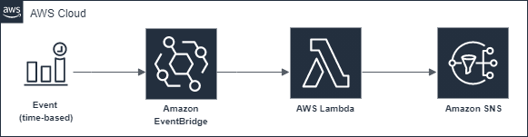

[](https://github.com/aws-samples/aws-sns-subscription-cleaner/actions/workflows/main.yml)
[](https://github.com/aws-samples/aws-sns-subscription-cleaner/actions/workflows/cve-check.yml)

# AWS SNS Subscription Cleaner

Detects and removes orphaned SNS subscriptions that belong to non-existent topics.

Runs in dry run mode to log orphaned subscriptions only or in production mode to perform cleanup operations.

## Architecture



## Prerequisites

- Java >= 8
- Maven >= 3.6.x
- AWS SAM CLI
- Docker >=17.x (optional - for local Lambda setup)

## Config

| Parameter | Type | Default | Description |
| --- | --- | --- | --- |
| `DRY_RUN` | Environment variable | `true` | Disables dry run mode to perform cleanup steps. Otherwise abandoned subscriptions are logged only. |
| `Schedule` | CloudWatch event config | `cron(0 0 * * ? *)` | Defines how often the cleanup function will run. Defaults to every 24 hours at midnight. |
| `Policies` | Lambda function policies | `AmazonSNSReadOnlyAccess` | To perform cleanup, write access to SNS is required. |

See [template.yml](template.yaml) for further details.

## Build

```bash
sam build
```

## Test
```bash
mvn test
```

## Deploy

```bash
sam deploy --guided
```

## Logs

```bash
sam logs -n SnsAbandonedSubscriptionCleaner --stack-name sns-abandoned-subscription-cleaner --tail
...
<timestamp> Checking topic arn:aws:sns:us-west-2:foo:bar.
<timestamp> Checking topic arn:aws:sns:us-west-2:foz:baz.
<timestamp> No abandoned subscriptions found.
<timestamp> Dry run mode. Skipping subscription cleanup.
```

## CI/CD

See [.github/workflows](.github/workflows).

## Security

See [CONTRIBUTING](CONTRIBUTING.md#security-issue-notifications) for more information.

## License

This project is licensed under the Apache-2.0 License.

